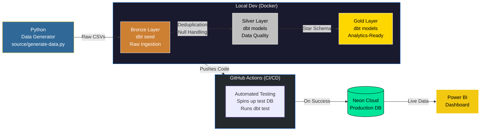

# 🛒 E-Commerce Analytics Data Pipeline & Dashboard

> An end-to-end ELT pipeline transforming raw e-commerce transactions into analytics-ready datasets, powered by dbt, PostgreSQL, Neon Cloud, GitHub Actions, and Power BI.


---

##  Architecture



---

##  Tech Stack

| Layer | Technology | Purpose |
|---|---|---|
| **Data Generation** | Python | Simulates raw e-commerce data with intentional defects |
| **Ingestion (Bronze)** | dbt Seeds | Loads raw CSVs into the warehouse as-is |
| **Transformation (Silver)** | dbt + SQL | Deduplication, null-handling, type-mismatch resolution |
| **Analytics (Gold)** | dbt + SQL | Star Schema — Fact & Dimension tables for reporting |
| **Local Dev DB** | PostgreSQL 15 | Local database container for safe development |
| **Production DB** | Neon (Cloud DB) | Serverless PostgreSQL for live dashboard connectivity |
| **CI/CD Pipeline** | GitHub Actions | Automated testing of SQL transformations on every push |
| **Visualization** | Power BI | Interactive business intelligence dashboard |

---

##  Medallion Architecture

This project follows a **Bronze → Silver → Gold** Medallion Architecture to ensure data quality at every stage of the pipeline.

```
 Raw Data (CSV)
    │
    ▼
 BRONZE  →  Raw ingestion via dbt seeds. No transformations. Data stored as-is.
    │
    ▼
 SILVER  →  Data quality enforcement: deduplication, null-handling,
              type-mismatch resolution using SQL window functions.
    │
    ▼
 GOLD    →  Analytics-ready Star Schema: dim_customer, dim_product, fct_order.
              Optimized for Power BI reporting.
```

---

##  Dashboard Preview

*(Add link to published Power BI web report here)*

The Power BI dashboard surfaces:
-  **Revenue Trends** over time
-  **Product Category Performance**
-  **Country-Level Sales Distribution**
-  **Order Volume & Customer Metrics**

---

##  CI/CD Pipeline (Automated Data Engineering)

To ensure high data quality and prevent bad code from breaking the production dashboard, a **CI/CD pipeline** was built using GitHub Actions.

Every time code is pushed to the repository:
1. GitHub Actions automatically spins up an ephemeral PostgreSQL database container.
2. It installs the exact versions of `dbt-core` and `dbt-postgres` used in the project.
3. It runs the entire dbt pipeline (`dbt seed`, `dbt run`, `dbt test`) against the test database.
4. Only if all transformations succeed without errors is the code considered safe.

---

##  Key Highlights

-  **Cloud-Native Production:** Transitioned from a local-only database to a Serverless Neon PostgreSQL database, enabling live dashboard access from anywhere.
-  **Automated CI/CD:** Implemented a GitHub Actions workflow to automatically test SQL transformations on a fresh, containerized database upon every commit.
-  **Real-World Data Cleaning:** Injected intentional defects (nulls, duplicates, type mismatches) into raw CSV data using Python, then resolved them in the Silver layer using window functions.
-  **Medallion Architecture:** Cleanly separated Bronze, Silver, and Gold layers for transparency, reusability, and testability.
-  **Star Schema Design:** Modelled Gold layer data into a Star Schema (Fact + Dimension tables) for optimized analytical query performance.
-  **Live BI Integration:** Power BI dashboard directly connected to the Neon cloud database, pulling live updates dynamically.
