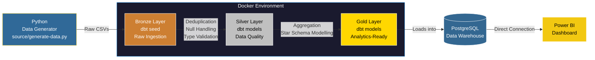

# 🛒 E-Commerce Analytics Data Pipeline & Dashboard

> An end-to-end ELT pipeline transforming raw e-commerce transactions into analytics-ready datasets, powered by dbt, PostgreSQL, Docker, and Power BI.


---

##  Architecture



---

##  Tech Stack

| Layer | Technology | Purpose |
|---|---|---|
| **Data Generation** | Python | Simulates raw e-commerce data with intentional defects |
| **Ingestion (Bronze)** | dbt Seeds | Loads raw CSVs into the warehouse as-is |
| **Transformation (Silver)** | dbt + SQL | Deduplication, null-handling, type-mismatch resolution |
| **Analytics (Gold)** | dbt + SQL | Star Schema — Fact & Dimension tables for reporting |
| **Warehouse** | PostgreSQL 15 | Centralized data store |
| **Containerization** | Docker & Docker Compose | Reproducible, portable environment |
| **Visualization** | Power BI | Interactive business intelligence dashboard |

---

##  Medallion Architecture

This project follows a **Bronze → Silver → Gold** Medallion Architecture to ensure data quality at every stage of the pipeline.

```
 Raw Data (CSV)
    │
    ▼
 BRONZE  →  Raw ingestion via dbt seeds. No transformations. Data stored as-is.
    │
    ▼
 SILVER  →  Data quality enforcement: deduplication, null-handling,
              type-mismatch resolution using SQL window functions.
    │
    ▼
 GOLD    →  Analytics-ready Star Schema: dim_customer, dim_product, fct_order.
              Optimized for Power BI reporting.
```

---

##  Dashboard Preview


The Power BI dashboard surfaces:
-  **Revenue Trends** over time
-  **Product Category Performance**
-  **Country-Level Sales Distribution**
-  **Order Volume & Customer Metrics**

---

##  Project Structure

```
E-Comm/
├──  source/
│   └── generate-data.py          # Python script to generate raw e-commerce data
├──  dbt_project/
│   └── dbt_ecomm/
│       ├── seeds/                 # Bronze: Raw CSV ingestion
│       │   └── ecommerce_sales.csv
│       └── models/
│           ├── bronze/            # Raw staging models
│           ├── silver/            # Cleaned & validated models
│           └── gold/              # Star Schema (Fact + Dimension tables)
│               ├── dim_customer.sql
│               ├── dim_product.sql
│               └── fct_order.sql
├──  E-Comm Dashboard/
│   ├── E-Commerce Analytics Dashboard.pbix
│   └── Screenshot 2026-06-17 085853.png
├──  Dockerfile
├──  docker-compose.yml
└──  README.md
```

---

##  Setup & Installation

### Prerequisites
- [Docker Desktop](https://www.docker.com/products/docker-desktop/) installed and running
- [Power BI Desktop](https://powerbi.microsoft.com/desktop/) (for viewing the dashboard)

### Steps

1. **Clone the repository:**
   ```bash
   git clone <your-github-repo-url>
   cd E-Comm
   ```

2. **Configure your credentials:**
   Open `docker-compose.yml` and `dbt_project/.dbt/profiles.yml` and replace the placeholders:
   ```yaml
   POSTGRES_USER: your_database_user
   POSTGRES_PASSWORD: your_database_password
   ```

3. **Start the environment:**
   ```bash
   docker-compose up -d
   ```

4. **Run dbt models:**
   ```bash
   docker exec -it dbt_core dbt run --project-dir /usr/app/dbt_ecomm
   ```

5. **Open the Dashboard:**
   Open `E-Comm Dashboard/E-Commerce Analytics Dashboard.pbix` in Power BI Desktop and connect to `localhost:5432`.

---

##  Key Highlights

-  **Real-World Pipeline Simulation:** Injected intentional defects (nulls, duplicates, type mismatches) into raw CSV data using Python, then resolved them in the Silver layer — mirroring real production data quality challenges.
-  **Medallion Architecture:** Cleanly separated Bronze, Silver, and Gold layers for transparency, reusability, and testability.
-  **Star Schema Design:** Modelled Gold layer data into a Star Schema (Fact + Dimension tables) for optimized analytical query performance.
-  **Fully Containerized:** The entire data environment runs in Docker, making it 100% reproducible on any machine.
-  **Business-Ready Dashboard:** Power BI dashboard directly connected to PostgreSQL, reducing stakeholder reporting time from hours to minutes.
